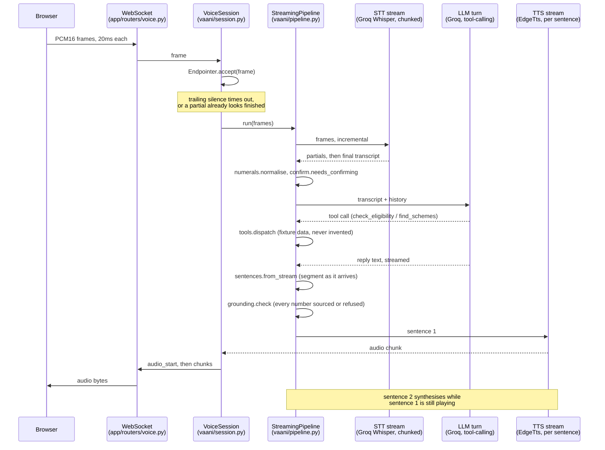
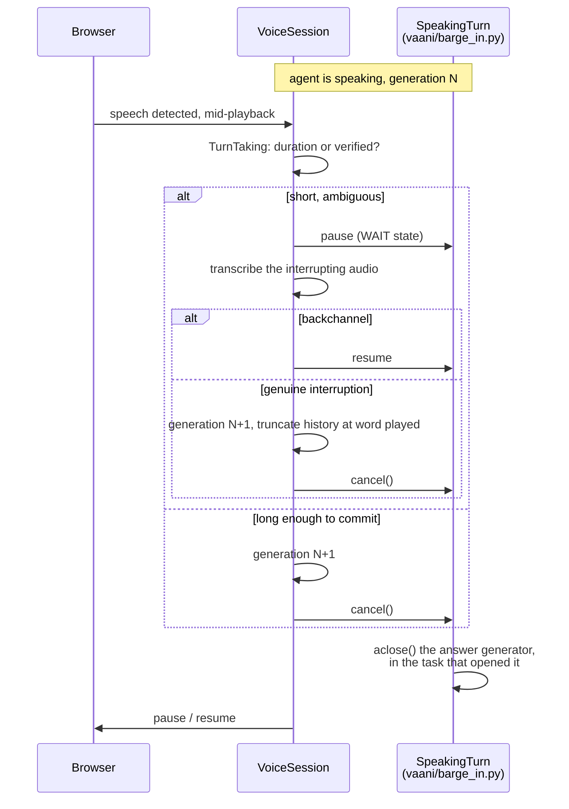
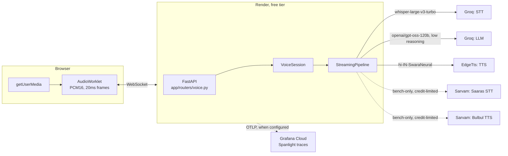

# Architecture

What is actually deployed, not an aspirational diagram. Regenerate this by hand
when a stage changes; there is no build step that keeps it honest automatically.

## One turn, overlapped

Sentence one's audio reaches the browser before the model has finished writing
sentence three. That overlap, not any single provider being fast, is what M1
built and M5 measures the size of.

## Barge-in

`SpeakingTurn.cancel()` awaits the cancelled task rather than firing and
forgetting: a cancel that returns early leaves a provider connection open
against a quota nobody is watching.

## Deployed today

Solid edges run on every real turn. Dashed edges are measurement paths: Sarvam
is `bench/waterfall.py --stack sarvam` only, never the deployed service
(QUOTAS.md), and Grafana Cloud traces are emitted whenever
`OTEL_EXPORTER_OTLP_ENDPOINT` is set and silently skipped when it is not,
logged once at startup either way.

The frontend is two static files on GitHub Pages
(`web/index.html`, `web/capture-worklet.js`), not the Vercel deployment SPEC
originally named; recorded as a deviation in DECISIONS.md.
